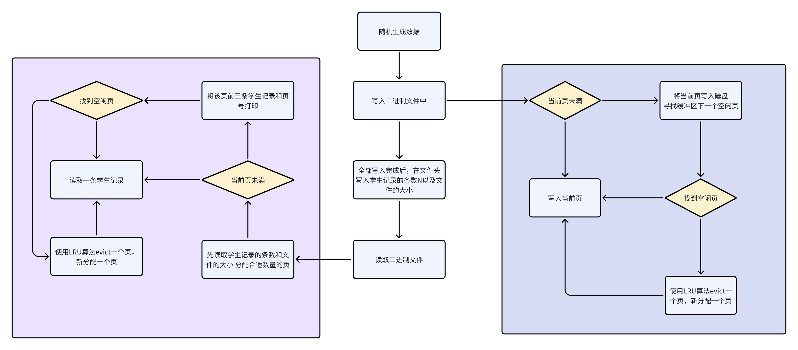
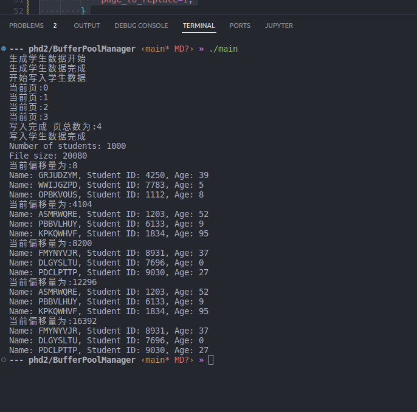

# 学生信息缓冲区管理模拟演示


# 系统架构




# 运行说明

main函数中修改文件路径以及生成学生记录的数量

```c++
int main() {
    const char *filename = "student_records.bin";
    int numStudents = 1000; // 假设生成 100000 条学生记录

    // 生成学生记录
    // Student* students[numStudents];
    Student** students = new Student*[numStudents];
    // std::vector<Student> students;
    BufferPool* bufferPool= new BufferPool(filename);
    // c++ 内部生成目标

    std::cout<<"生成学生数据开始"<<std::endl;
    generateStudentRecords(students, numStudents);
    std::cout<<"生成学生数据完成"<<std::endl;


    // 将学生记录写入二进制文件
    std::cout<<"开始写入学生数据"<<std::endl;
    bufferPool->writeStudentRecords(students,numStudents);
    std::cout<<"写入学生数据完成"<<std::endl;

    // 读取学生记录
    bufferPool->readStudentRecords();

    return 0;
}
```


## LRU算法

采取全局时间戳的方法先找到未使用的Page 没有再去找Last_used的page

```c++
int BufferPool::findFreePage(){
    // 检查buffer中最小的last_used
    int min_last_used=99999;
    int page_to_replace=0;
    for(int i=0;i<BUFFER_SIZE;i++){
        // 未满
        if(buffer[i]->last_used==0){
            return i;
        }
        // 调用lru
        if(buffer[i]->last_used<min_last_used){
            min_last_used=buffer[i]->last_used;
            page_to_replace=i;
        }
    }
    flushPageToFile(buffer[page_to_replace]);
    buffer[page_to_replace]=new Page(currentPageNumber++);
    return page_to_replace;
}
```


# 运行结果

测试数据1000条学生记录




测试结果10000条学生记录


